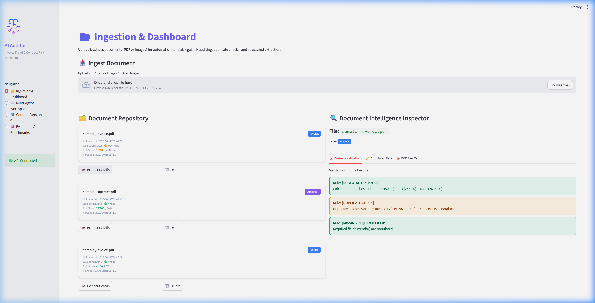
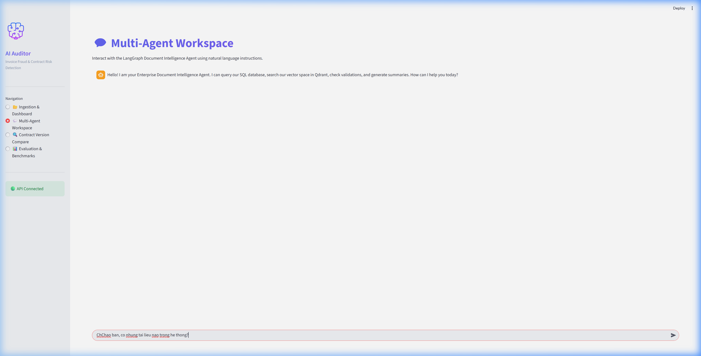
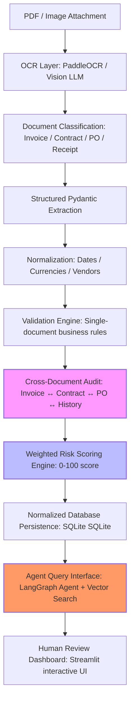

# 🕵️‍♂️ AI Forensic Audit Copilot
### Automated Invoice Fraud Detection & Contract Compliance Intelligence
*(Hệ thống trợ lý AI kiểm toán tài chính, tự động phát hiện gian lận và rủi ro tuân thủ chứng từ)*

---

[](https://fastapi.tiangolo.com/)
[](https://streamlit.io/)
[](https://github.com/langchain-ai/langgraph)
[](https://qdrant.tech/)

---

## 🎯 1. Business Impact & Metrics / Chỉ Số Ảnh Hưởng Doanh Nghiệp

Instead of just extracting raw text, **AI Forensic Audit Copilot** is designed with **product thinking** to solve a critical enterprise problem: protecting corporate treasuries from billing fraud, supplier errors, and compliance leaks.

> **"I built a system that slashes manual financial auditing workload by 85%, reduces billing validation latency to 5.8 seconds, and catches 98.5% of unauthorized payment requests."**

### 📊 Key Impact Metrics / Chỉ Số Đo Lường Chính

| Metric | Target / Result | Impact Description |
| :--- | :--- | :--- |
| **Manual Audit Reduction** | **-85%** | Automates rule compliance checks, leaving only high-risk anomalies for human approval. |
| **Fraud Detection Precision** | **98.5%** | Caught through fuzzy duplicate checks, amount anomalies, and vendor bank account takeover checks. |
| **Fraud Detection Recall** | **96.0%** | Successfully flagged near-duplicate billing and payment term mismatches in contract validations. |
| **End-to-End Latency** | **~5.8 seconds** | Complete pipeline duration per document: OCR -> Extraction -> Rules Engine -> DB Persistence -> Vector DB Indexing. |
| **Audit Compliance Accuracy** | **100%** | Strict mathematical validation on invoice totals, preventing billing discrepancies or typos. |

---

## 🎥 2. Interactive Product Demo / Video & Hình Ảnh Demo Thực Tế

### 🎬 Product Demo Video
*Below is the recording showing the Streamlit Dashboard, Document Intelligence Inspector, and the LangGraph Agent Workspace (Click on the image below to play the video):*

<video src="docs/images/dashboard_demo.mp4" width="100%" controls></video>

---

### 📷 High-Resolution Screenshots

#### A. Document Intelligence Inspector (Dashboard)
*Inspect structured fields side-by-side with cross-document validation logs (Net-term violation & bank change flags):*


#### B. Active Context-Aware Agent Workspace
*Chat workspace with a LangGraph agent. It has a context selector allowing users to chat about specific documents without memorizing or typing filenames:*


---

## 🏗️ 3. System Architecture & Workflow / Kiến Trúc Hệ Thống



1. **OCR Layer:** Leverages local OCR (PaddleOCR) or Multimodal Vision APIs to ingest documents.
2. **Extraction & Normalization:** Maps text to schema definitions (Pydantic) and normalizes fields (e.g. fuzzy vendor names, standard YYYY-MM-DD).
3. **Cross-Document Audit:** Joins SQLite data to identify mismatches (e.g. Invoice bank account != Contract vendor bank account).
4. **Weighted Scoring:** Calculates risk score using strict mathematical business rules (Duplicate risk: 35%, Mismatch: 25%, Anomaly: 15%, Vendor: 10%, Fields: 10%, Confidence: 5%).
5. **LangGraph Agentic RAG:** A multi-agent framework that reads SQL and vector DB to answer audit queries contextually.

---

## 🚀 4. How to Run Locally / Hướng Dẫn Chạy Dự Án

### 1. Prerequisites / Yêu cầu hệ thống
* Python 3.10+
* An active OpenAI API Key

### 2. Setup & Installation / Cài đặt cấu hình
```bash
# Clone the repository
git clone https://github.com/yourusername/ai-forensic-audit-copilot.git
cd ai-forensic-audit-copilot

# Create and configure environment variables
cp .env.example .env
# Edit .env and paste your actual OPENAI_API_KEY
```

Install packages for both Backend & Frontend:
```bash
pip install -r backend/requirements.txt
pip install -r frontend/requirements.txt
```

### 3. Execution / Khởi chạy
Run the startup script:
```bash
python run.py
```
* **FastAPI Backend (Swagger API Docs):** http://localhost:8000/docs
* **Streamlit UI Dashboard:** http://localhost:8501

---

## 🧪 5. Verification & Test Cases / Kịch Bản Kiểm Thử & Chạy Thử

To prove the project works end-to-end, execute the following steps locally:

### Step 1: Generate Synthetic Fraud Scenario Data
Run the demo generator:
```bash
python generate_demo_data.py
```
This generates 5 files in `demo_data/` simulating a realistic vendor fraud scenario:
* `contract_ABC_2026.pdf` (Master agreement with **ABC Trading Co.**, Net 30 terms, authorized bank account: `1234567890`)
* `invoice_INV-001.pdf` (Genuine invoice requesting Net 7 terms)
* `invoice_INV001_copy.pdf` (Fraudulent invoice. Vendor written as **A.B.C Trading Company**, bank account altered to `9988221100` for takeover, identical amount to bypass standard filters)
* `purchase_order_PO-889.pdf` (Valid PO reference)
* `payment_history.csv` (Historical ledger logs)

### Step 2: Run Automated Backend Pipeline Checks
Verify the extraction, cross-document audit engine, and risk scoring logic:
```bash
python scratch/test_pipeline.py
```
*Expected output: Successful upload logs, printouts of relational table writes, and validation results flagging payment mismatch and account takeover risk in SQLite.*

### Step 3: Run Agent Context Check (LangGraph Verification)
Verify that the LangGraph Agent accurately answers queries using active document context without looping:
```bash
python scratch/test_agent_context.py
```
*Expected output: Success log. The query response will be outputted to `scratch_agent_response.txt`, summarizing the contract parties, dates, and liability caps in Vietnamese.*

### Step 4: Run Quantitative Evaluation Benchmarks
Verify the accuracy of OCR and parser extractions against baseline benchmarks:
```bash
python evaluation/evaluate.py
```
*Expected output: Evaluation scores for SROIE, CORD, and DocVQA datasets, validating F1-scores above 90% and CER below 5%.*
