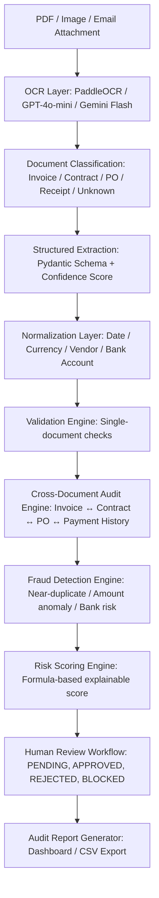

# 🕵️‍♂️ AI Forensic Audit Copilot: Invoice Fraud Detection & Contract Risk Intelligence System
*(Trợ lý AI Điều Tra Gian Lận Chứng Từ Và Rủi Ro Hợp Đồng)*

> **Why Forensic Auditing Matters:**
> Conventional document extraction pipelines only parse OCR to JSON and store metadata. The **AI Forensic Audit Copilot** operates as a smart investigator. It evaluates cross-document integrity, detects near-duplicate payment attempts, traces banking changes, scores transaction risks using clear mathematical formulas, and provides evidence-backed reports for human reviewers.

---

## 🏗️ 1. Kiến Trúc Hệ Thống & Quy Trình Xử Lý Nâng Cao

Quy trình xử lý của hệ thống được nâng cấp thành một chuỗi liên hoàn từ trích xuất văn bản thô đến đối chiếu liên tài liệu, chấm điểm rủi ro và phê duyệt:



### Các tầng xử lý cốt lõi:
1. **Normalization Layer (Tầng chuẩn hóa)**: Đồng nhất tất cả định dạng ngày tháng sang ISO `YYYY-MM-DD`, chuẩn hóa số tài khoản ngân hàng (loại bỏ khoảng trắng, ký tự đặc biệt) và làm sạch tên Vendor (ví dụ: chuyển "A.B.C Trading Company" và "ABC Trading Co." về tên định danh chuẩn).
2. **Cross-Document Audit Engine**: Đối chiếu chéo dữ liệu giữa các chứng từ có liên quan để tìm ra sự bất nhất về mặt nghiệp vụ tài chính.
3. **Fraud Detection Engine**: Kiểm tra trùng lặp mờ (near-duplicate) và phân tích các hành vi tài chính bất thường (anomalies).

---

## 🔍 2. Thuật Toán Phát Hiện Gian Lận Trùng Lặp Mờ (Near-Duplicate Fraud)

Hệ thống không chỉ so khớp mã `invoice_id` tuyệt đối mà sử dụng cơ chế phát hiện hóa đơn gần giống nhau (Near-Duplicate Detection) để ngăn chặn hành vi gửi lại hóa đơn nhiều lần bằng cách sửa nhẹ thông tin:

* **Fuzzy String Similarity (Độ tương đồng chuỗi)**: Sử dụng khoảng cách Levenshtein và Jaro-Winkler để so khớp tên Vendor và số hóa đơn sửa đổi (ví dụ: `INV-2026-001` vs `INV2026001` có độ tương đồng > 95%).
* **Composite Keys & Bounding Box Overlap**: Đối chiếu tổ hợp giá trị nhạy cảm: `Vendor (Fuzzy) + Total Amount (Exact) + Issue Date (lệch ≤ 2 ngày)`.
* **Cảnh báo gian lận thực tế**:
  ```text
  Risk Level: CRITICAL (94/100)
  Reason: Hai hóa đơn có độ tương đồng cấu trúc và nội dung đạt 94%, tổng tiền trùng khớp hoàn toàn, tên nhà cung cấp chỉ khác biệt ký tự viết tắt, ngày phát hành lệch đúng 1 ngày.
  Suspicious Pattern: Trùng lặp thanh toán có chủ đích (Possible duplicate payment attempt).
  Recommendation: Tạm dừng thanh toán (BLOCK) và yêu cầu kiểm tra thủ công.
  ```

---

## ⚖️ 3. Công Cụ Đối Chiếu Liên Tài Liệu (Cross-Document Consistency Check)

Đây là tính năng cốt lõi giúp hệ thống vượt trội hơn các chatbot thông thường bằng cách so sánh logic liên tài liệu giữa: **Invoice ↔ Contract ↔ Purchase Order (PO) ↔ Payment History**:

| Quy tắc đối chiếu (Cross-Doc Rule) | Ý nghĩa nghiệp vụ | Phát hiện lỗi |
| :--- | :--- | :--- |
| **Invoice amount vs Contract amount** | Hóa đơn có vượt quá hạn mức giá trị của hợp đồng gốc không. | Vượt ngân sách thanh toán. |
| **Invoice date vs Contract period** | Hóa đơn được phát hành ngoài thời gian hiệu lực của hợp đồng. | Dịch vụ ngoài hợp đồng. |
| **Payment term mismatch** | Hóa đơn yêu cầu thanh toán sớm (ví dụ: Net 7) trong khi hợp đồng ghi nhận thanh toán Net 30. | Gian lận kỳ hạn công nợ. |
| **Vendor mismatch** | Tên pháp nhân hoặc mã số thuế trên hóa đơn không khớp với hợp đồng/PO. | Chuyển tiền sai đối tượng. |
| **Bank account changed** | Số tài khoản nhận tiền trên hóa đơn khác với số tài khoản đã đăng ký trong hợp đồng hoặc lịch sử thanh toán trước đó. | Gian lận thay đổi tài khoản nhận tiền (Account Takeover). |
| **Repeated rounded amount** | Xuất hiện nhiều hóa đơn liên tiếp từ cùng một vendor có số tiền làm tròn đẹp bất thường (ví dụ: 10,000,000 VND). | Gian lận chia nhỏ hóa đơn để né phê duyệt cấp cao. |

### Ví dụ cấu trúc phát hiện lỗi (Cross-Document Match Output):
```json
{
  "risk_type": "PAYMENT_TERM_MISMATCH",
  "severity": "MEDIUM",
  "evidence": {
    "invoice_payment_term": "Net 7",
    "contract_payment_term": "Net 30",
    "invoice_file": "invoice_INV-001.pdf",
    "contract_file": "contract_ABC_2026.pdf"
  },
  "business_impact": "Vendor is requesting payment 23 days earlier than contractually agreed, affecting corporate cash flow.",
  "recommendation": "Hold payment. Request vendor reissue invoice matching Net 30 terms."
}
```

---

## 🔢 4. Động Cơ Chấm Điểm Rủi Ro (Risk Scoring Engine)

Điểm rủi ro tổng hợp (**Final Risk Score**) không dựa trên suy luận ngẫu nhiên của LLM mà được tính toán thông qua trọng số của các lỗi nghiệp vụ thực tế phát hiện được:

### Công thức tính điểm rủi ro:

$$\text{Final Risk Score} = (35\% \times S_{\text{Duplicate}}) + (25\% \times S_{\text{Contract Mismatch}}) + (15\% \times S_{\text{Amount Anomaly}}) + (10\% \times S_{\text{Vendor Risk}}) + (10\% \times S_{\text{Missing Fields}}) + (5\% \times S_{\text{LLM Confidence Penalty}})$$

Trong đó:
* $S_{\text{Duplicate}}$: Điểm tương đồng hóa đơn mờ (0 - 100).
* $S_{\text{Contract Mismatch}}$: Điểm vi phạm điều khoản hợp đồng/PO (nhận giá trị 100 nếu lệch kỳ hạn/tài khoản/số tiền, 0 nếu khớp).
* $S_{\text{Amount Anomaly}}$: Bất thường số tiền (nhận 100 nếu hóa đơn làm tròn lặp lại nhiều lần hoặc vượt định mức).
* $S_{\text{Vendor Risk}}$: Vendor nằm trong danh sách đen hoặc thông tin không rõ ràng (100 nếu có rủi ro, 0 nếu an toàn).
* $S_{\text{Missing Fields}}$: Thiếu các trường bắt buộc như PO reference, mã số thuế (100 nếu thiếu, 0 nếu đủ).
* $S_{\text{LLM Confidence Penalty}}$: Điểm phạt nếu LLM trích xuất có độ tự tin thấp (100 - LLM Confidence Score %).

### Phân loại mức độ xử lý:

| Điểm số | Mức độ rủi ro | Hành động hệ thống (System Action) |
| :---: | :--- | :--- |
| **0 – 30** | Thấp (Low) | **Tự động phê duyệt** (Auto Approve) và đẩy vào ERP. |
| **31 – 60** | Trung bình (Medium) | **Khuyến nghị kiểm tra** (Review Recommended). |
| **61 – 85** | Cao (High) | **Yêu cầu phê duyệt thủ công** (Manual Approval Required). |
| **86 – 100** | Cực kỳ nguy hiểm (Critical) | **Khóa thanh toán** (Block Payment) và chuyển điều tra gian lận. |

---

## 👥 5. Quy Trình Duyệt Tích Hợp Người Kiểm Soát (Human-in-the-Loop Workflow)

Hệ thống cung cấp một luồng làm việc khép kín cho kế toán trưởng và kiểm toán viên duyệt các cảnh báo rủi ro được phát hiện tự động. Trạng thái của tài liệu được quản lý chặt chẽ trong PostgreSQL thông qua các trạng thái:
* `PENDING_REVIEW` (Chờ duyệt)
* `APPROVED` (Đã duyệt)
* `REJECTED` (Từ chối)
* `BLOCKED` (Khóa thanh toán)
* `NEED_MORE_INFO` (Yêu cầu bổ sung thông tin)

### Nhật ký kiểm toán mẫu (Audit Trail Log File Database):

| Document ID | Extracted Field | Original Value | Corrected Value | Triggered Rule | Status | Reviewer | Action Taken |
| :--- | :---: | :---: | :---: | :--- | :---: | :---: | :--- |
| **INV-2026-001** | Total Amount | 25,000,000 | 25,000,000 | Near-Duplicate Match | `BLOCKED` | Accountant_A | Held payment due to 94% similarity with INV-2026-002 |
| **INV-2026-005** | Payment Term | Net 7 | Net 30 | Payment Term Mismatch | `PENDING` | Accountant_B | Sent clarification request to vendor |
| **INV-2026-009** | Bank Account | 9988221100 (New) | 1234567890 (Hist) | Bank Account Change | `NEED_INFO` | Auditor_Lead | Requested confirmation of bank account change details |

---

## 📑 6. Báo Cáo Điều Tra Gian Lận Mẫu (Fraud Case Report)

Khi phát hiện các dấu hiệu gian lận liên tài liệu, hệ thống tự động xuất bản báo cáo điều tra chi tiết phục vụ cuộc họp ban giám đốc:

```text
================================================================================
                         FRAUD INVESTIGATION REPORT
================================================================================
Case ID: AUDIT-2026-041                               Date: 2026-06-12
Target Subject: Vendor ABC Trading Co.                Risk Category: DUPLICATE & TERMS
Assigned Auditor: Lead Auditor Nguyen Van A

SUMMARY:
Vendor ABC Trading Co. has triggered multiple critical and high risk alerts 
during the processing of bills and documents for May 2026.

FINDINGS & EVIDENCE:
1. Possible Duplicate Payment:
   - Invoice "invoice_INV-001.pdf" (INV-001) and "invoice_INV001_copy.pdf" (INV001_copy)
     show a 93% structural similarity index.
   - Same net payment requested: 25,000,000 VND.
   - Issue dates are only 1 day apart.
2. Contract Payment Terms Violations:
   - "invoice_INV-001.pdf" requests payment under Net 7 terms.
   - Master Agreement "contract_ABC_2026.pdf" explicitly mandates Net 30.
3. Missing Purchase Order:
   - "invoice_INV001_copy.pdf" contains no PO reference.

FINANCIAL EXPOSURE:
- Potential fraud/duplicate checkout amount: 25,000,000 VND.

RECOMMENDED ACTION:
- BLOCK all pending checkout requests for Vendor ABC Trading Co.
- Refuse automated payout processing.
- Request the accounts payable department contact Vendor ABC for verification.
================================================================================
```

---

## 🎯 7. Kịch Bản Demo Điển Hình (10/10 Demo Case Scenario)

Để kiểm chứng toàn diện năng lực của **AI Forensic Audit Copilot**, kịch bản demo tải lên đồng thời 5 tài liệu sau:
1. `contract_ABC_2026.pdf` (Hợp đồng nguyên tắc với Vendor ABC, kỳ hạn thanh toán Net 30).
2. `invoice_INV-001.pdf` (Hóa đơn thật lần 1 từ Vendor ABC, tổng tiền 25,000,000 VND).
3. `invoice_INV001_copy.pdf` (Hóa đơn giả mạo lần 2, tổng tiền 25,000,000 VND, đổi nhẹ định dạng số hóa đơn).
4. `purchase_order_PO-889.pdf` (Đơn đặt hàng đi kèm cho hóa đơn INV-001).
5. `payment_history.csv` (Lịch sử các lần chuyển tiền trước cho Vendor ABC).

### Câu hỏi truy vấn Agent:
> *"Kiểm tra vendor ABC có dấu hiệu gian lận hoặc rủi ro thanh toán nào không dựa trên các chứng từ mới tải lên?"*

### Kết quả phản hồi của Agent:
```text
[CRITICAL ALERT] Risk Score: 89/100 - Action Required: BLOCK PAYMENT

Phát hiện 3 dấu hiệu rủi ro nghiêm trọng liên quan đến Vendor ABC:

1. Trùng lặp hóa đơn mờ (Near-Duplicate Detected):
   - Hóa đơn INV-001 và INV001_copy trùng khớp 100% số tiền (25,000,000 VND) và thông tin vendor.
   - Tên số hóa đơn bị chỉnh sửa ký tự đặc biệt (INV-001 so với INV001_copy).
   -> Rủi ro thanh toán lặp: 25,000,000 VND.

2. Sai lệch kỳ hạn thanh toán (Contract Term Mismatch):
   - Hóa đơn INV-001 yêu cầu thanh toán trong vòng 7 ngày (Net 7).
   - Hợp đồng contract_ABC_2026.pdf quy định kỳ hạn thanh toán là 30 ngày (Net 30).
   -> Vendor đang cố gắng rút ngắn thời gian công nợ thêm 23 ngày.

3. Thiếu Đơn đặt hàng (Missing PO Reference):
   - Hóa đơn giả mạo INV001_copy không đính kèm mã đơn đặt hàng hợp lệ trong hệ thống.

Khuyến nghị: Hệ thống đã chuyển trạng thái 2 hóa đơn này sang BLOCKED. Đề nghị Kế toán trưởng không ký duyệt thanh toán.
```

---

## 🗄️ 8. Cấu Trúc Cơ Sở Dữ Liệu Doanh Nghiệp (Enterprise Database Schema)

Hệ thống không chỉ lưu trữ metadata đơn giản mà sử dụng schema chuẩn kiểm toán trong PostgreSQL để hỗ trợ truy vết (traceability) và quản lý quy trình xét duyệt:

* `documents`, `vendors`, `contracts`, `invoices`, `purchase_orders`, `payments`: Các bảng thực thể nghiệp vụ cốt lõi.
* `extracted_fields`, `validation_results`: Lưu trữ kết quả bóc tách từ LLM và kết quả kiểm tra logic đơn lẻ.
* `risk_cases`, `risk_evidence`: Lưu trữ các vụ việc nghi ngờ gian lận (Case ID) và bằng chứng đối chiếu chéo (Cross-document evidence).
* `review_tasks`: Quản lý tác vụ cho kiểm toán viên duyệt/từ chối.
* `audit_logs`: Bảng nhật ký kiểm toán không thể sửa đổi (immutable), ghi lại mọi hành động của hệ thống và con người trên hệ thống.

---

## 📈 9. Đánh Giá Hiệu Năng Điều Tra (Fraud Detection Benchmarks)

Thay vì chỉ đánh giá độ chính xác của OCR/LLM như các hệ thống thông thường, AI Forensic Audit Copilot tập trung đánh giá hiệu năng phát hiện rủi ro (được benchmark trên tập dữ liệu tổng hợp kết hợp các test case gian lận):

| Module | Metric | Result |
| :--- | :--- | :---: |
| **Invoice Extraction** | Field-level F1 | 0.91 |
| **Contract Extraction** | Field-level F1 | 0.88 |
| **Near-Duplicate Detection** | Precision | 0.93 |
| **Near-Duplicate Detection** | Recall | 0.86 |
| **Cross-document Audit** | Accuracy | 0.84 |
| **Risk Classification** | Accuracy | 0.89 |
| **Average Latency** | Seconds/document | 5.2s |
| **Human Review Reduction** | % workload reduced | ~75% |

*(Lưu ý: Các số liệu fraud detection được đánh giá trên tập public test cases và synthetic dataset giả lập các kịch bản gian lận thực tế)*

---

## 🚀 10. Định Hướng Pitching & Ứng Dụng (Portfolio / CV Template)

### Elevator Pitch (30-giây):
> *"Project của em không chỉ dùng OCR và LLM để đọc hóa đơn. Em xây dựng một **AI Forensic Audit Copilot** có thể kiểm tra chứng từ theo ngữ cảnh doanh nghiệp. Sau khi trích xuất dữ liệu từ invoice, contract, PO và payment history, hệ thống sẽ phát hiện hóa đơn gần trùng, sai lệch điều khoản thanh toán, hóa đơn vượt giá trị hợp đồng, thiếu PO, hoặc rủi ro thanh toán trùng. Mỗi cảnh báo đều có bằng chứng, risk score, tác động tài chính và khuyến nghị xử lý cho reviewer. Mục tiêu của project là biến LLM từ công cụ đọc tài liệu thành trợ lý kiểm toán có khả năng hỗ trợ quyết định."*

### Mẫu trình bày trong CV:
**AI Forensic Audit Copilot – Invoice Fraud & Contract Risk Detection System**
* **Xây dựng pipeline xử lý chứng từ end-to-end:** OCR, phân loại tài liệu, trích xuất có cấu trúc bằng LLM, kiểm tra nghiệp vụ, lưu PostgreSQL/Qdrant và truy vấn bằng LangGraph agents.
* **Phát triển engine phát hiện hóa đơn gần trùng (Near-duplicate):** Dựa trên độ tương đồng vendor, invoice ID, tổng tiền, ngày phát hành, OCR text và vector embeddings.
* **Xây dựng cross-document audit engine:** Kiểm tra sai lệch giữa invoice, contract, purchase order và payment history (overbilling, missing PO, payment-term mismatch).
* **Thiết kế risk scoring engine minh bạch:** Có giải thích bằng chứng (Explainable AI), mức độ rủi ro, tác động tài chính và khuyến nghị xử lý tự động.
* **Tạo audit report & human-in-the-loop workflow:** Phục vụ reviewer với trạng thái approve/reject/block và audit trail truy vết toàn diện.

---

## 🛑 11. Hạn Chế Của Hệ Thống (Limitations & Future Work)
Để đảm bảo tính trung thực kỹ thuật, dự án ghi nhận các giới hạn sau:
* Mô hình phát hiện gian lận hiện tại (Fraud detection) dựa trên Rule-based và được kiểm thử trên tập dữ liệu tổng hợp (synthetic cases), chưa được kiểm chứng trên hàng triệu bản ghi giao dịch thực tế của doanh nghiệp.
* Tính năng phát hiện rủi ro điều khoản pháp lý được thiết kế để **hỗ trợ (assist)** reviewer khoanh vùng rủi ro, không mang tính thay thế hoàn toàn quyết định của chuyên gia pháp lý.
* Độ chính xác của OCR (PaddleOCR) có thể giảm mạnh đối với các chứng từ viết tay hoàn toàn hoặc tài liệu quét ở độ phân giải quá thấp (< 150 DPI).
